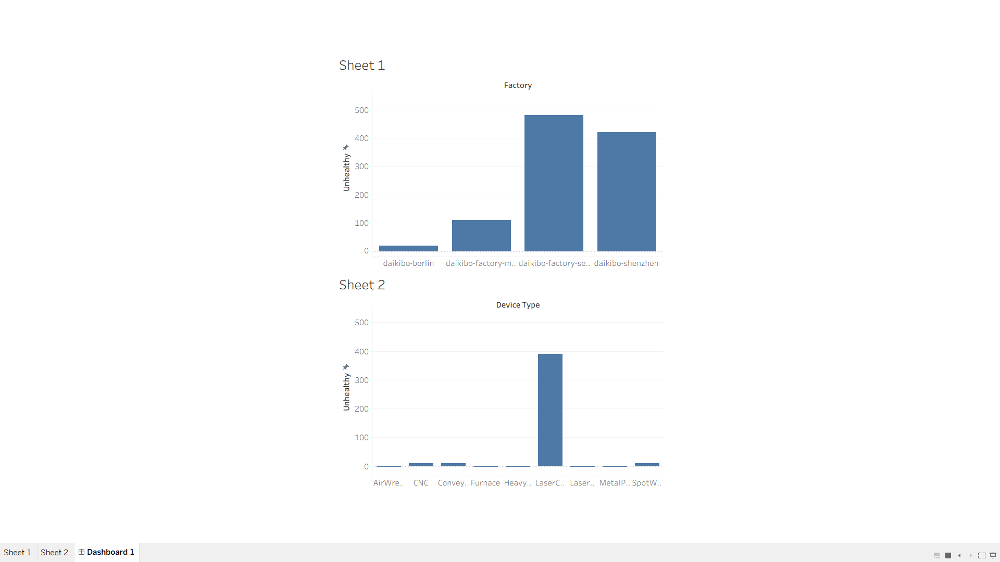
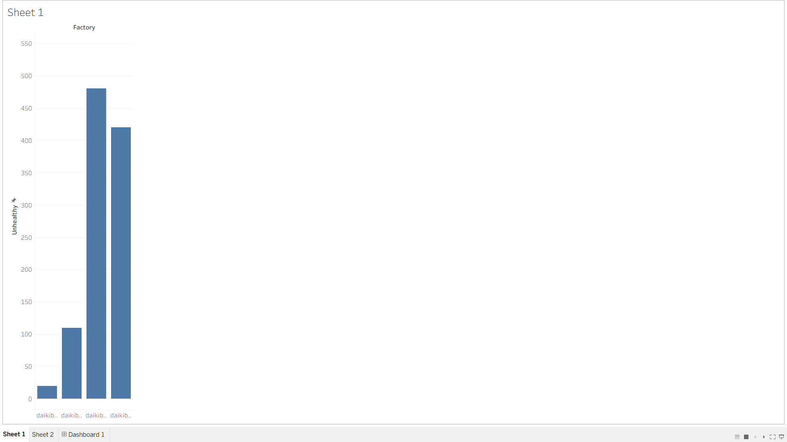
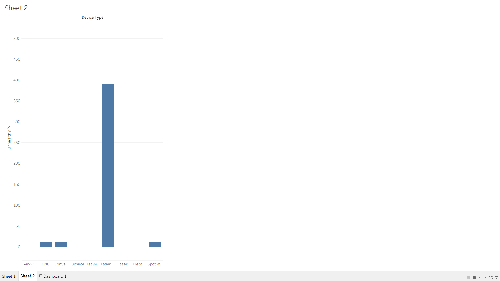

# Deloitte Data Analytics Job Simulation (Forage)

## Project Overview

This project was completed as part of the Deloitte Data Analytics Job Simulation on Forage.

The project focuses on analyzing Daikibo telemetry data using Tableau to identify factories and device types with the highest number of unhealthy machine records.

## Business Task

The objective was to answer two business questions:

1. Which Daikibo factory has the highest number of unhealthy machine statuses?
2. Which device type contributes the most unhealthy records?

## Dataset
- Dataset Name: daikibo-telemetry-data.json
- Format: JSON
- Total Records: 160,704
- Source: Deloitte Data Analytics Job Simulation (Forage)

## Tools Used
- Tableau Public
- JSON Dataset
- Data Analysis
- Data Visualization

## Dashboard
The dashboard contains:

- Factory-wise unhealthy machine count
- Device type-wise unhealthy machine count

## Key Insights
- Compared unhealthy machine records across factories.
- Identified the device type generating the highest unhealthy records.
- Created visual dashboards to support business decision-making.

## Repository Contents
- README.md
- Deloitte Forage Certificate (PDF)
- Dashboard Screenshot
- Sheet 1 Screenshot
- Sheet 2 Screenshot

## Skills Demonstrated
- Data Cleaning
- Data Analysis
- Tableau
- Dashboard Design
- Business Insights
## Dashboard Preview

### Dashboard

### Sheet 1

### Sheet 2

## Certificate
## Certificate

[View Deloitte Forage Certificate](Deloitte_Forage_Certificate.pdf)
